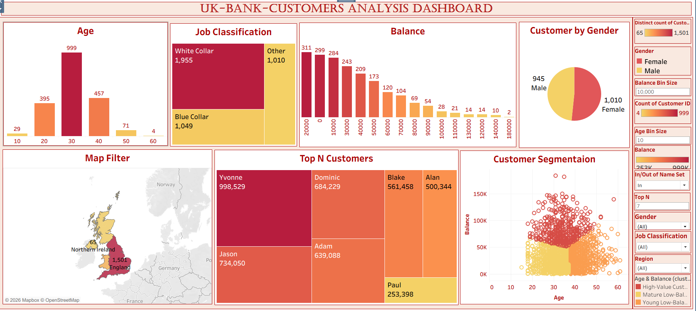

# 📊 UK Bank Customer Analysis Dashboard (Tableau)

## 🧠 Overview

This project presents an interactive analysis of a UK bank customer dataset using **Tableau**.  
It explores customer behavior across multiple dimensions such as age, account balance, geographic distribution, and customer segmentation.

The goal is to explore the data in an interactive way that allows deeper understanding of patterns and supports extraction of meaningful insights through visualization.

This project was developed during my learning journey in the **ITI Power BI track**.

---

## 📂 Dataset Description

The dataset represents UK bank customers and contains demographic and financial information used for exploratory analysis and customer segmentation.

It includes the following features:

| Column Name          | Description                          |
|----------------------|--------------------------------------|
| Customer ID          | Unique identifier for each customer  |
| Name                 | Customer first name                  |
| Surname              | Customer last name                   |
| Gender               | Customer gender                      |
| Age                  | Age of the customer                 |
| Region               | Geographic region of the customer    |
| Job Classification   | Customer job category               |
| Date Joined         | Date when customer joined the bank  |
| Balance              | Account balance of the customer     |

These variables allow analysis of customer demographics, financial behavior, and regional distribution, and are used to build insights around segmentation and value contribution.

---

## 🖼️ Dashboard Preview

---

## 📊 Dashboard Visualizations & Insights

### 🔹 Age Distribution (Histogram)
Dynamic binning was applied using Parameters to control the bin size and explore age distribution more effectively.  
💡 Insight: The majority of customers fall within the 30–45 age range, representing the core segment.

---

### 🔹 Balance Distribution (Histogram)
Shows how customer balances are distributed across different ranges.  
💡 Insight: The distribution is heavily skewed toward lower balances, while a small group holds significantly higher values.

---

### 🔹 Geographical Analysis (Map View)
Visualizes customer distribution across regions.  
💡 Insight: Some regions have higher customer concentration, which can support targeted business decisions.

---

### 🔹 Top N Customers (Treemap)
Built using Parameters + Sets to dynamically filter top customers based on balance.  
💡 Insight: A small percentage of customers contributes a large portion of total value, highlighting the importance of high-value customer retention.

---

### 🔹 Customer Segmentation (Scatter Plot + Clustering)
Analyzes the relationship between Age and Balance using clustering techniques.  
This results in three main segments:

- 💰 High-Value Customers  
- 🌱 Young Low-Balance Customers  
- ⚠️ Mature Low-Balance Customers  

💡 Insight: Customers show distinct behavioral patterns that require different engagement strategies depending on their segment.

---

## 💡 Key Insights Summary

- Majority of customers are in the 30–45 age group  
- Balance distribution is skewed toward lower values  
- High-value customers represent a small group but contribute significantly  
- Customer behavior varies clearly across clusters  
- Geographic distribution shows concentrated customer regions  
- Interactive filters and parameters enhance exploration and analysis  

---

## ⚙️ Tools & Techniques

- Tableau  
- Parameters 
- Bins 
- Sets  
- Dynamic Binning  
- Clustering  
- Interactive Dashboards  

---

👩‍💻 Author

Name: Yomna Ahmed Hamdy
Data Analyst & Data Scientist
Track: Power BI – ITI